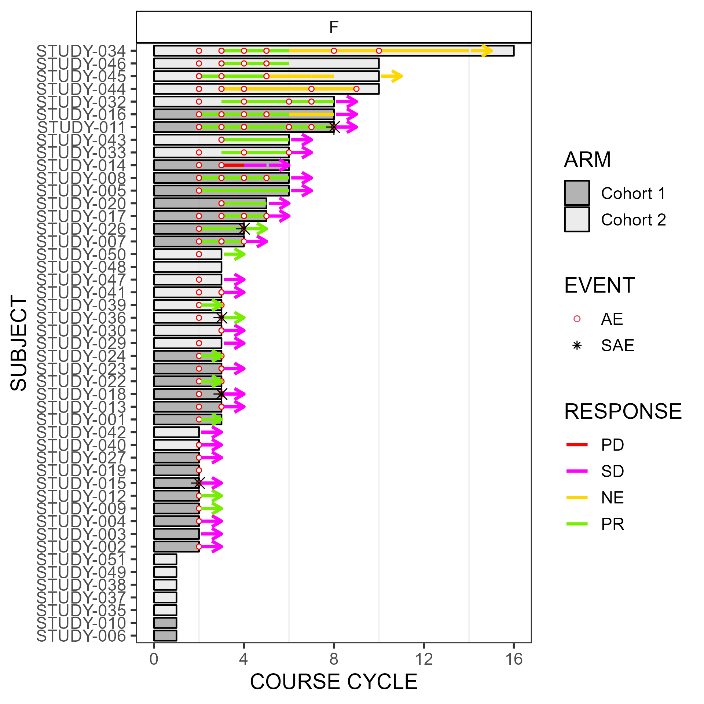
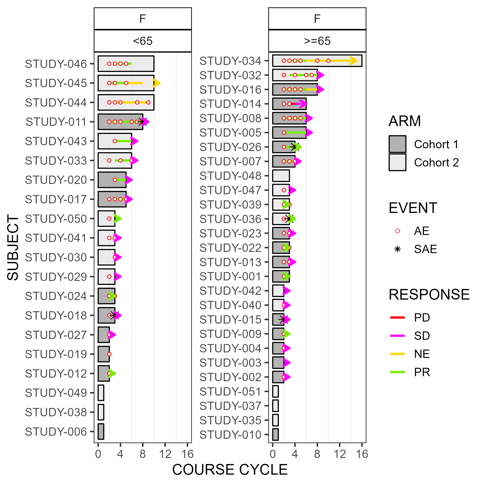

<!-- This file is used to create README.md
Note that the README.md document may need updating to change
'\<0.001' to '<0.001'. 
-->

# swimplot

<!-- badges: start -->

[](https://lifecycle.r-lib.org/articles/stages.html#stable)
[](https://CRAN.R-project.org/package=swimplot)
[](https://cran.r-project.org/package=swimplot)

<!-- badges: end -->

Swimmer plots are used to show a patient’s response over time
(i.e. days), or by treatment course cycle.

## Installation

You can install the main version of **swimplot** from
[GitHub](https://github.com/) with:

``` r
# install.packages("devtools")
devtools::install_github("biostatsPMH/swimplot", ref="main")
```

An alternative version of **swimplot** which allows for patterns in the
bars (eg. stripes) can be installed from [GitHub](https://github.com/)
with:

``` r
# install.packages("devtools")
devtools::install_github("biostatsPMH/swimplot", ref="pattern")
```

## Documentation

[Online Documentation](https://biostatsPMH.github.io/swimplot/)

## Examples

### Swimmer plot that includes AE event status by course cycle

Uses addendum simulated study data. The below swimmer plot stratifies by sex,
but all participants are female.

The *width*, *height* and *scale* parameters in ggsave() can be modified
to fit a large plot.

``` r
library(ggplot2);
library(swimplot);
data("arm", "res", "ae");

res$RESPONSE <- as.factor(res$RESPONSE);
levels(res$RESPONSE) <- c("PD", "SD", "NE", "PR", "CR");

p <- swimmer_plot(df=arm,id='SUBJECT',end='END_TRT',name_fill='ARM',id_order ='increasing',col="black",alpha=0.75,width=.8,base_size=14,stratify= c('SEX')) +
  swimmer_lines(df_lines=res,id='SUBJECT',start='RESPONSE_START',end='RESPONSE_END',name_col='RESPONSE',size=1)+
  swimmer_points(df_points=ae,id='SUBJECT',time='COURSE_NUM',name_shape='EVENT',name_col='EVENT',fill='white',size=c(1.25, 3)[as.factor(ae$EVENT)])+
  swimmer_arrows(df_arrows=res,id='SUBJECT',arrow_start='RESPONSE_END',cont='CONTINUED_RESPONSE',name_col='RESPONSE',show.legend=FALSE,type="open",cex=1) +
  scale_fill_manual(values=c('grey60', 'grey90'))+
  scale_colour_manual(name='RESPONSE',values=c('PD'='red', 'SD'='magenta1', 'NE'='gold', 'PR'='chartreuse2', 'CR'='turquoise2', 'AE'='red', 'SAE'='black'), breaks = c('PD', 'SD', 'NE', 'PR', 'CR'))  +
  scale_shape_manual(values=c(21, 8))+
  ylab("COURSE CYCLE") + xlab("SUBJECT")+
  scale_y_continuous(minor_breaks = seq(0, max(arm$END_TRT), by=2), breaks = seq(0, max(arm$END_TRT), by=4))+
  theme(panel.grid.minor = element_line(colour="grey95", size=0.5))+
  guides(shape = guide_legend(override.aes = list(col=c(2,1))),color=guide_legend(override.aes = list(shape=NA)));

ggsave(paste("man/figures/clin_trial_SEX", ".png", sep=""), p, width=6.4, height=6.4, device="png", scale=1);
```



The next swimmer plot stratifies by sex and age category.

``` r
library(ggplot2);
library(swimplot);
data("arm", "res", "ae");

res$RESPONSE <- as.factor(res$RESPONSE);
levels(res$RESPONSE) <- c("PD", "SD", "NE", "PR", "CR");

p <- swimmer_plot(df=arm,id='SUBJECT',end='END_TRT',name_fill='ARM',id_order ='increasing',col="black",alpha=0.75,width=.8,base_size=14,stratify= c('SEX','AGE')) +
  swimmer_lines(df_lines=res,id='SUBJECT',start='RESPONSE_START',end='RESPONSE_END',name_col='RESPONSE',size=1)+
  swimmer_points(df_points=ae,id='SUBJECT',time='COURSE_NUM',name_shape='EVENT',name_col='EVENT',fill='white',size=c(1.25, 3)[as.factor(ae$EVENT)])+
  swimmer_arrows(df_arrows=res,id='SUBJECT',arrow_start='RESPONSE_END',cont='CONTINUED_RESPONSE',name_col='RESPONSE',show.legend=FALSE,type="open",cex=1) +
  scale_fill_manual(values=c('grey60', 'grey90'))+
  scale_colour_manual(name='RESPONSE',values=c('PD'='red', 'SD'='magenta1', 'NE'='gold', 'PR'='chartreuse2', 'CR'='turquoise2', 'AE'='red', 'SAE'='black'), breaks = c('PD', 'SD', 'NE', 'PR', 'CR'))  +
  scale_shape_manual(values=c(21, 8))+
  ylab("COURSE CYCLE") + xlab("SUBJECT")+
  scale_y_continuous(minor_breaks = seq(0, max(arm$END_TRT), by=2), breaks = seq(0, max(arm$END_TRT), by=4))+
  theme(panel.grid.minor = element_line(colour="grey95", size=0.5))+
  guides(shape = guide_legend(override.aes = list(col=c(2,1))),color=guide_legend(override.aes = list(shape=NA)));

ggsave(paste("man/figures/clin_trial_SEX_AGE", ".png", sep=""), p, width=6.4, height=6.4, device="png", scale=1);
```


